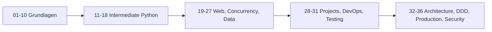

# Python3_Kurs

     

Praxisnaher Python-Kurs mit didaktischer Tiefe, professioneller Struktur und realen Projektbeispielen.

Von den Grundlagen bis zu Security Engineering, Architektur-Patterns und Production-Ready Python.

---

## Warum dieses Repository?

Dieser Kurs ist als langfristiges Lernsystem aufgebaut, nicht als lose Sammlung von Code-Snippets.

- Fokus auf inhaltliche Tiefe statt fester Notebook-Anzahl
- Schrittweise Lernprogression von Einsteiger bis Advanced
- Theorie, Praxis, Uebungen und Loesungen in jedem Kapitel
- Konsistente Terminologie und strukturierte Kapitelarchitektur
- Aktuelle Themen wie Clean Architecture, CQRS, TDD, Observability und Security Engineering

---

## Inhaltsverzeichnis

- Projektueberblick
- Lernarchitektur
- Kapitelmatrix (01-36)
- Neue Themen (Kapitel 32-36)
- Lernmodus und Didaktik
- Schnellstart
- Repository-Struktur
- Mitwirken
- Lizenz

---

## Projektueberblick

| Kennzahl    | Wert                                   |
| ----------- | -------------------------------------- |
| Kapitel     | 36                                     |
| Notebooks   | 212                                    |
| Sprache     | Deutsch                                |
| Zielniveau  | Beginner bis Advanced                  |
| Schwerpunkt | Praxis, Architektur, Testing, Security |

### Zielgruppe

- Einsteiger, die Python strukturiert lernen wollen
- Fortgeschrittene, die professionelle Engineering-Themen suchen
- Lehrende und Teams, die ein didaktisch konsistentes Kursmaterial benoetigen

---

## Lernarchitektur



### Lernpfade

| Pfad               | Kapitel | Ergebnis                                         |
| ------------------ | ------- | ------------------------------------------------ |
| Core Python        | 01-18   | Sichere Sprach- und OOP-Basis                    |
| Web und Daten      | 19-27   | Web-Grundlagen, Async, Data Stack                |
| Projektpraxis      | 28-31   | Deployment, Capstone, QA                         |
| Professional Track | 32-36   | Architektur, Teststrategie, Security Engineering |

---

## Kapitelmatrix (01-36)

| Nr. | Kapitel                                                                                            | Fokus                                  |
| --- | -------------------------------------------------------------------------------------------------- | -------------------------------------- |
| 01  | [01_Variablen](01_Variablen)                                                                       | Variablen, Zuweisung, Grundlagen       |
| 02  | [02_GrundlegendeDatentypen](02_GrundlegendeDatentypen)                                             | Datentypen und Typverhalten            |
| 03  | [03_Operatoren](03_Operatoren)                                                                     | Arithmetik, Vergleich, Logik           |
| 04  | [04_BedingteAnweisungen](04_BedingteAnweisungen)                                                   | Kontrollfluss mit if/elif/else         |
| 05  | [05_Schleifen](05_Schleifen)                                                                       | for, while, Steueranweisungen          |
| 06  | [06*Listen_Tupel* Dictionaries_Mengen](06_Listen_Tupel_%20Dictionaries_Mengen)                     | Zentrale Datenstrukturen               |
| 07  | [07_Funktionen](07_Funktionen)                                                                     | Funktionen, Parameter, Rueckgaben      |
| 08  | [08_Eingebaute_Funktionen](08_Eingebaute_Funktionen)                                               | Built-ins und idiomatische Nutzung     |
| 09  | [09_Module_und_Standardbibliothek](09_Module_und_Standardbibliothek)                               | Module, Importe, Stdlib                |
| 10  | [10_Fehlerbehandlung](10_Fehlerbehandlung)                                                         | Exceptions und Fehlerstrategien        |
| 11  | [11_Modulen](11_Modulen)                                                                           | Modulare Strukturierung                |
| 12  | [12_DatenSpeichern](12_DatenSpeichern)                                                             | Persistenz und Dateiformate            |
| 13  | [13_Textverarbeitung](13_Textverarbeitung)                                                         | Strings, Regex, Parsing                |
| 14  | [14_Grafische_Benutzeroberflaechen](14_Grafische_Benutzeroberflaechen)                             | GUI-Grundlagen                         |
| 15  | [15_Iterator_und_Generatoren](15_Iterator_und_Generatoren)                                         | Iterator-Protokoll, Generatoren        |
| 16  | [16_Grafik_Programmieren](16_Grafik_Programmieren)                                                 | Zeichenlogik und Visualisierung        |
| 17  | [17_Objektorientierte_Programmierung](17_Objektorientierte_Programmierung)                         | OOP und Klassenentwurf                 |
| 18  | [18_Datenbanktechnik](18_Datenbanktechnik)                                                         | SQL, ORMs, NoSQL-Basics                |
| 19  | [19_Dynamische_Webseiten_CGI_WSGI](19_Dynamische_Webseiten_CGI_WSGI)                               | CGI/WSGI und Web-Request-Lebenszyklus  |
| 20  | [20_Multithread_und_asynchrone_Programmierung](20_Multithread_und_asynchrone_Programmierung)       | Threading, Asyncio, Concurrency        |
| 21  | [21_Python_Errors](21_Python_Errors)                                                               | Debugging und Fehlerarchitektur        |
| 22  | [22_Professionelle_Software_Entwicklung](22_Professionelle_Software_Entwicklung)                   | Clean Code, Team-Workflows             |
| 23  | [23_Datenanalyse_NumPy](23_Datenanalyse_NumPy)                                                     | Numerik mit NumPy                      |
| 24  | [24_Datenanalyse_Pandas](24_Datenanalyse_Pandas)                                                   | Datenanalyse mit Pandas                |
| 25  | [25_Matplotlib](25_Matplotlib)                                                                     | Datenvisualisierung mit Matplotlib     |
| 26  | [26_Seaborn](26_Seaborn)                                                                           | Statistische Visualisierungen          |
| 27  | [27_Flask](27_Flask)                                                                               | Web-Apps mit Flask                     |
| 28  | [28_Wissenschaftliche_Projekte](28_Wissenschaftliche_Projekte)                                     | Wissenschaftliche Python-Praxis        |
| 29  | [29_Python_Deployment_und_DevOps](29_Python_Deployment_und_DevOps)                                 | Deployment, CI/CD, DevOps-Basics       |
| 30  | [30_Capstone_Projekte_und_Interview_Vorbereitung](30_Capstone_Projekte_und_Interview_Vorbereitung) | Abschlussprojekte und Interviews       |
| 31  | [31_Testing_und_Qualitaetssicherung](31_Testing_und_Qualitaetssicherung)                           | Unit, Integration, E2E, QA             |
| 32  | [32_Architektur_und_Security_Patterns](32_Architektur_und_Security_Patterns)                       | N-Tier, Onion, Clean, CQRS, JWT        |
| 33  | [33_DDD_TDD_EDD_und_Design_Patterns](33_DDD_TDD_EDD_und_Design_Patterns)                           | DDD, TDD, EDD, Pattern-Katalog         |
| 34  | [34_Production_Ready_Python](34_Production_Ready_Python)                                           | Observability, Resilienz, SLOs         |
| 35  | [35_Advanced_Testing_Patterns](35_Advanced_Testing_Patterns)                                       | Property, Contract, Mutation Testing   |
| 36  | [36_Security_Engineering_in_Python](36_Security_Engineering_in_Python)                             | Threat Modeling, OWASP, Secure Release |

---

## Neue Themen (Kapitel 32-36)

Die letzten Kapitel erweitern den Kurs gezielt in Richtung professioneller Softwareentwicklung.

| Kapitel | Schwerpunkt                        | Typische Technologien                         |
| ------- | ---------------------------------- | --------------------------------------------- |
| 32      | Architektur- und Security-Patterns | FastAPI, JWT, Clean Architecture, CQRS        |
| 33      | DDD/TDD/EDD und Design Patterns    | Ubiquitous Language, Aggregates, Event-Design |
| 34      | Production-Ready Python            | Logging, Metriken, Tracing, Resilienz         |
| 35      | Advanced Testing Patterns          | Hypothesis, Contract Tests, Mutation Testing  |
| 36      | Security Engineering in Python     | Threat Modeling, OWASP Top 10, Security Gates |

---

## Lernmodus und Didaktik

Das Repository folgt einer festen Lernphilosophie:

- Tiefgang vor Oberflaeche
- Theorie vor Code
- Beispiele mit anschliessender Erklaerung
- Progressive Uebungen (leicht bis projektorientiert)
- Technische Fachbegriffe mit Kontext und Praxisbezug

Jede Einheit ist so aufgebaut, dass sie sowohl einzeln nutzbar als auch in der Gesamtprogression logisch anschlussfaehig ist.

---

## Schnellstart

### Voraussetzungen

- Python 3.13+
- VS Code
- Jupyter Notebook Extension

### Lokaler Start

```bash
python -m venv .venv
.venv\Scripts\activate
pip install jupyter
jupyter notebook
```

### Empfohlene Reihenfolge

1. Kapitel 01-10 fuer die Sprachbasis
2. Kapitel 11-18 fuer strukturierte Python-Modelle
3. Kapitel 19-31 fuer Web, Data, Deployment und Testing
4. Kapitel 32-36 fuer Architektur, Production und Security Engineering

---

## Repository-Struktur

```text
Python3_Kurs/
|- 01_Variablen/
|- ...
|- 31_Testing_und_Qualitaetssicherung/
|- 32_Architektur_und_Security_Patterns/
|- 33_DDD_TDD_EDD_und_Design_Patterns/
|- 34_Production_Ready_Python/
|- 35_Advanced_Testing_Patterns/
|- 36_Security_Engineering_in_Python/
|- README.md
|- ROADMAP.md
|- CHANGELOG.md
|- AGENTS.md
```

---

## Mitwirken

Pull Requests und Issues sind willkommen.

Bitte beachte dabei:

- Sprache und Didaktik konsistent in Deutsch halten
- Struktur der Notebooks respektieren (Theorie, Beispiele, Uebungen, Loesungen)
- Technische Korrektheit und Lernwert gleichermassen absichern
- Aenderungen in [CHANGELOG.md](CHANGELOG.md) dokumentieren

---

## Lizenz

Dieses Projekt steht unter der MIT-Lizenz.
